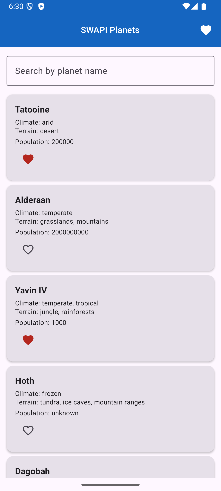
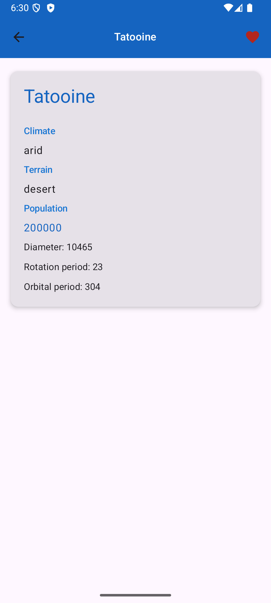
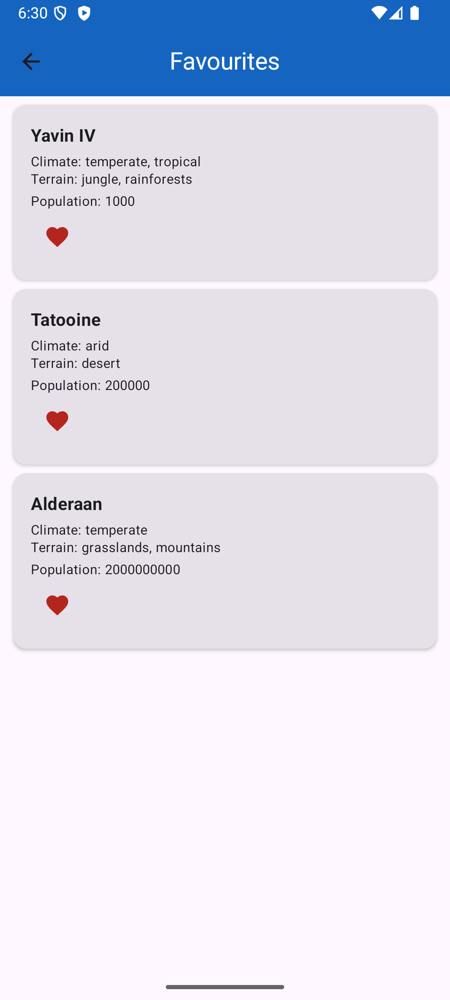
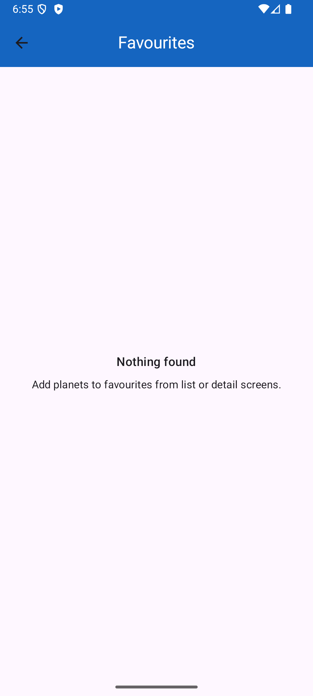
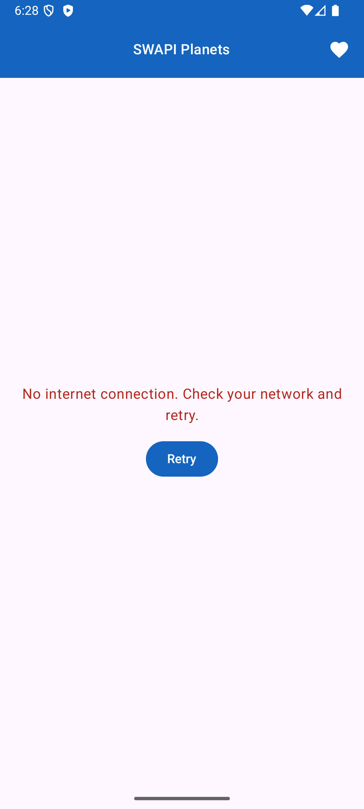
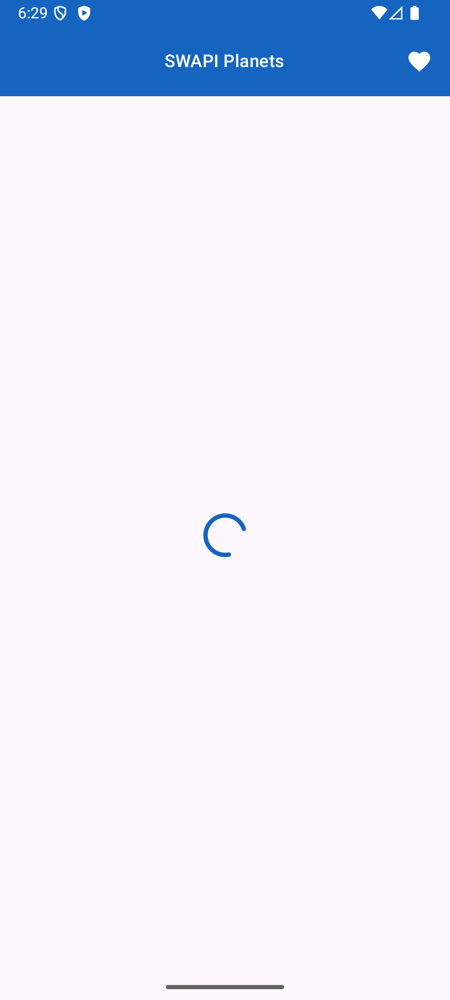

# Домашнее задание 4 

ФИО: Вражкин Роман Евгеньевич  
Группа: Б9123-09.03.03пикд(1)

API: [SWAPI](https://swapi.dev/)  
Используется список планет и детали планеты по id.

## Room
Сценарий: **Favourites** (избранное переживает перезапуск приложения)

Таблица:
- `favourite_planets`
- поля: `planetId` (PRIMARY KEY)

Как используется:
- при нажатии на сердечко планета добавляется/удаляется из таблицы
- экран `Favourites` читает id из Room и показывает сохраненные планеты

Как проверить:
1. Открыть список планет
2. Добавить нужные планеты в избранное
3. Полностью закрыть приложение
4. Запустить снова
5. Открыть экран `Favourites` - увидеть добавленные планеты

## Скриншоты

  
  
  
  
  
  

